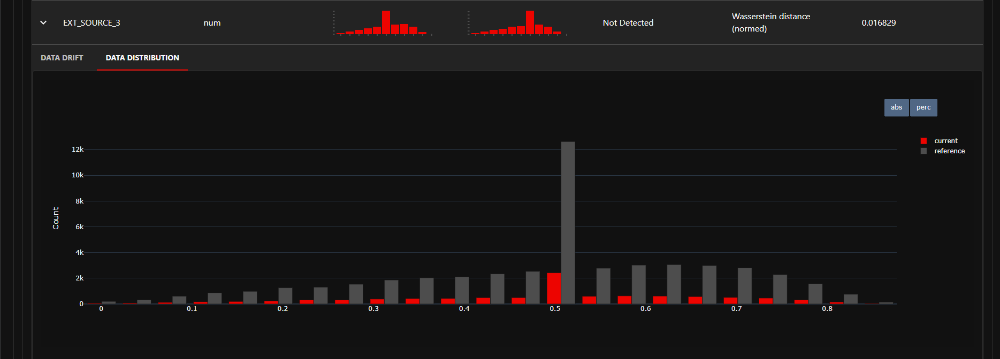

# Predicting Credit Risk: An End-to-End MLOps Architecture
### A Production-Grade Machine Learning Pipeline on 307,511 Loan Applications

---

## The Question

Predicting loan defaults is one of the oldest problems in data science. But in modern industry, writing a training script that yields high accuracy locally is only 10% of the battle. The real challenge is **productionization**: How do you serve that model reliably? How do you track its versions? How do you ensure it doesn't silently degrade when real-world economic data shifts?

This project builds a **complete, containerized Machine Learning Operations (MLOps) pipeline** to answer these questions. It doesn't just predict whether an applicant will default; it establishes a robust architecture to track experiments, serve predictions via a REST API, monitor data drift in real-time, and enforce continuous integration.

---

## The Data

The foundation of this project is the Home Credit Default Risk dataset, containing **307,511 raw loan applications**. 

The fundamental challenge in credit risk is **class imbalance** — the vast majority of applicants pay back their loans, while only about **8%** default. A naive model that always predicts "No Default" achieves 92% accuracy with zero useful recall. This forces a shift away from accuracy toward probability ranking and operational metrics.

| Metric | Value |
|---|---|
| Total Loan Applications | 307,511 |
| Default Rate (Positive Class) | ~8.0% |
| Features Engineered | 250+ |

Instead of relying solely on raw bureau inputs, the pipeline engineers deep financial interaction features. By creating custom metrics like `DEBT_INCOME_RATIO`, `ANNUITY_INCOME_RATIO`, and aggregating external scoring sources (`EXT_SCORE_MEAN`), the XGBoost model is fed a rich, domain-specific representation of applicant financial health.

---

## The Architecture: Moving Beyond the Local Environment

This project implements a 4-stage MLOps lifecycle to bring the model into a production state.

### 1. Experiment Tracking & Model Registry (MLflow)

When training models, hyperparameters and metrics often get lost in terminal outputs. **MLflow** is integrated to act as the central nervous system for model training. Every run logs its parameters (e.g., `learning_rate`, `max_depth`) alongside its evaluation metrics.


Once a model is deemed production-ready, it is transitioned into the **Model Registry**. The registry strictly controls which version of the XGBoost model is currently staged or deployed.


---

### 2. Model Serving (FastAPI)

A model is useless if downstream applications can't communicate with it. A high-performance REST API was built using **FastAPI** and **Pydantic**. 

Rather than returning a binary "Yes/No" for default, the `/predict` endpoint returns a precise `default_probability` alongside a business-logic `risk_tier` (Low, Medium, High). This allows risk curators to apply different strictness thresholds depending on the macroeconomic climate.


---

### 3. Continuous Monitoring & Data Drift (Evidently AI & Streamlit)

Models degrade. If inflation spikes or unemployment drops, the distribution of incoming applicants will change, causing the model to make poor decisions on data it has never seen. 

To combat this, **Evidently AI** is implemented to continuously monitor the Wasserstein distance between the *reference* data (what the model was trained on) and the *current* data (what is flowing through the API). 

By monitoring granular feature distributions—such as the imputation peaks in `EXT_SOURCE_3`—we can trigger automated retraining pipelines *before* business metrics suffer. This drift report is embedded directly into a live **Streamlit Dashboard**.




---

### 4. Continuous Integration (GitHub Actions)

To ensure that new feature branches or architectural changes don't break the live API, a **CI/CD pipeline** was established using GitHub Actions. On every push to the repository, a cloud runner provisions an Ubuntu environment, installs all dependencies, and executes a rigorous `pytest` suite. 

Crucially, the API is programmed with **graceful degradation**—if the CI/CD server lacks the heavy MLflow artifacts, the API intelligently falls back to a dummy mode to validate code integrity without failing the build.


---

## Evaluation: Operating-Point Metrics

Because of the heavy class imbalance, the model is evaluated on its ability to separate the classes across the entire distribution rather than a hard threshold.

| Metric | Value | Interpretation |
|---|---|---|
| **ROC-AUC** | **0.7600** | The model has a 76% chance of ranking a random defaulter higher than a random payer. |
| **KS Statistic** | **0.3863** | Measures the maximum separation between the cumulative distributions of defaulters and non-defaulters. A KS > 0.30 indicates a highly operational credit model. |

---

## Tech Stack

Unlike purely analytical projects, this architecture requires a blend of data science and software engineering tooling.

### 🧠 Machine Learning & Data
| Tool | Role |
|---|---|
| **XGBoost** | The core gradient boosted tree classifier. Chosen for its dominance in tabular data and handling of sparse/missing financial records. |
| **Pandas / NumPy** | High-performance feature engineering and vectorization. |

### ⚙️ Engineering & Operations
| Tool | Role |
|---|---|
| **MLflow** | Experiment tracking, hyperparameter logging, and model versioning. |
| **FastAPI** | Asynchronous API framework for serving model inferences at scale. |
| **Docker** | Containerization of the API and its dependencies to eliminate environment mismatches. |
| **Evidently AI** | Statistical drift detection using Earth Mover's Distance (Wasserstein) on live data. |
| **Streamlit** | Rapid deployment of the monitoring UI for risk managers. |
| **GitHub Actions** | Automated CI/CD testing and deployment verification using Pytest. |

---

## Repository Structure

```text
credit_risk_mlops/
├── .github/workflows/
│   └── ci.yml                  # GitHub Actions CI/CD pipeline
├── api/
│   └── main.py                 # FastAPI application and prediction logic
├── dashboard/
│   └── app.py                  # Streamlit monitoring dashboard
├── docker/
│   ├── Dockerfile              # API container image definition
│   └── docker-compose.yml      # Multi-container orchestration
├── figures/                    # Architecture and evaluation screenshots
├── src/
│   ├── features/               # Data engineering pipelines
│   ├── training/               # XGBoost model training scripts
│   └── monitoring/             # Evidently drift report generation
├── tests/
│   └── test_api.py             # Pytest suite for API endpoints
├── .gitignore
├── requirements.txt
└── README.md
